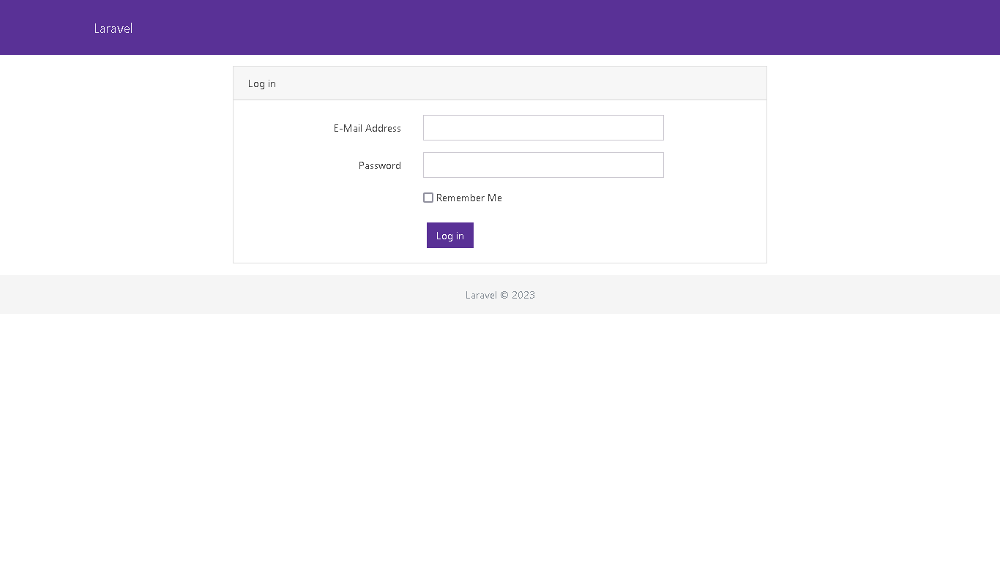
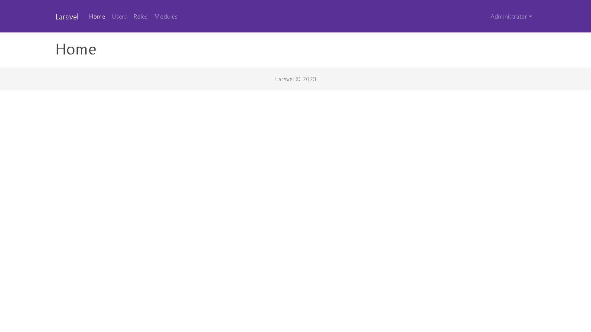
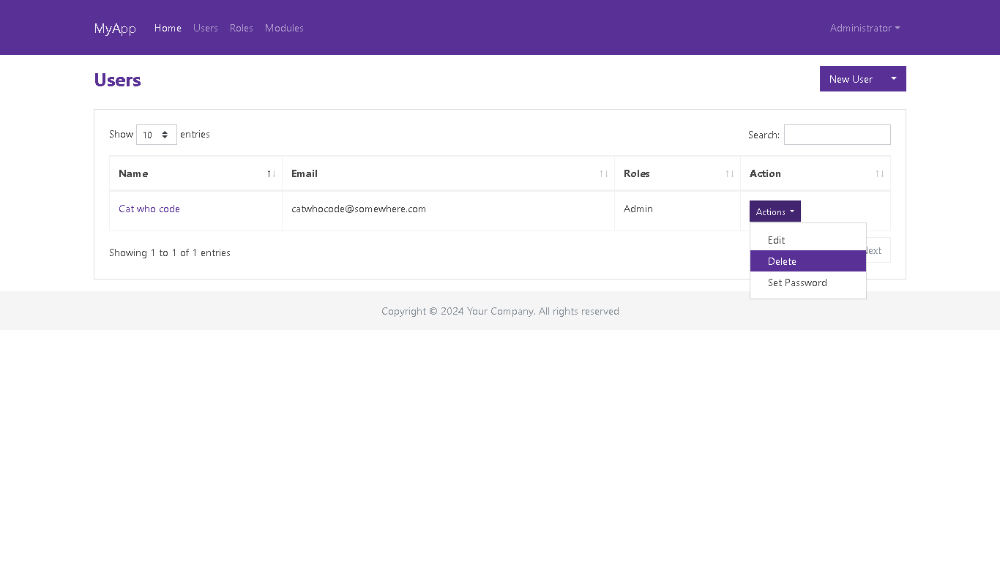
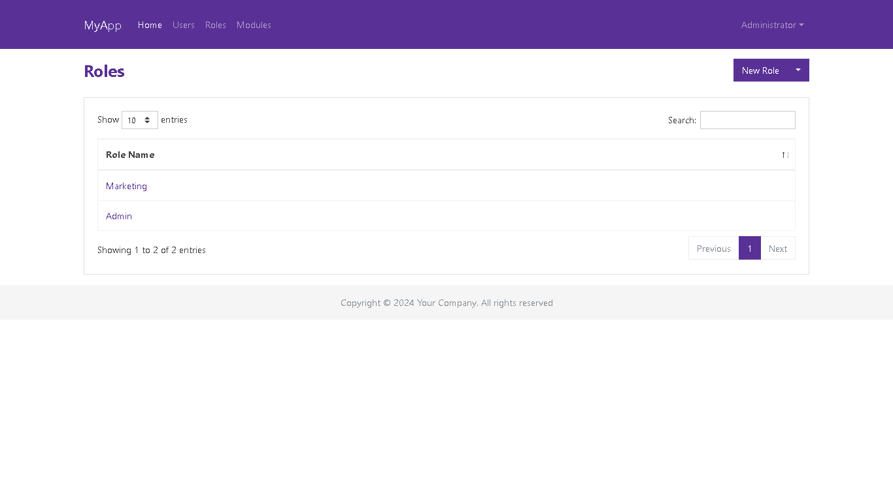

## Simple admin dashboard

This is a simple admin dashboard built with [Laravel](https://www.laravel.com/)

Contributors:
- [Indra](https://github.com/KingSit3)
- [Jamal](https://github.com/jamalulinsan)
- [Reynold](https://github.com/nekrophantom)
- [Reza](https://github.com/AaEzha)

## Getting started

- Download MailHog [here](https://github.com/mailhog/MailHog) and run it
- Clone this repository:
  `git clone https://github.com/catwhocode/admin-sederhana`
- Enter to your project foler:
  `cd admin-sederhana`
- Install packages:
  `composer install`
- Copy .env.example to .env:
  `cp .env.example .env`
- Edit .env file
- Generate application key:
  `php artisan key:generate`
- Run migration:
  `php artisan migrate --seed`
- Run the webserver
  `php artisan serve`
- Point your browser to `http://localhost:8000`

### Administrator

- email: admin@admin.com
- password: password

## Features

- Login
- ~~Register~~
- ~~Forgot Password~~
- ~~Reset Password~~
- Dashboard sederhana
- CRUD User
- CRUD Role ([Laravel Permission](https://github.com/spatie/laravel-permission))
- Module Management ([Laravel Modules](https://github.com/nWidart/laravel-modules))
- Update profile
- Update password
- Logout

## Frontend

- CSS: [Bootstrap CSS](https://getbootstrap.com),
- Template: [Bootswatch](https://bootswatch.com/).
    - You can switch theme by replacing **bootstrap.min.css** in **public/css** folder.

## Screenshots

#### Login

#### Dashboard

#### Users

#### Roles

## Contribute

Fork this repo, make some update then send Pull Request

## License

- [MIT license](https://opensource.org/licenses/MIT).
